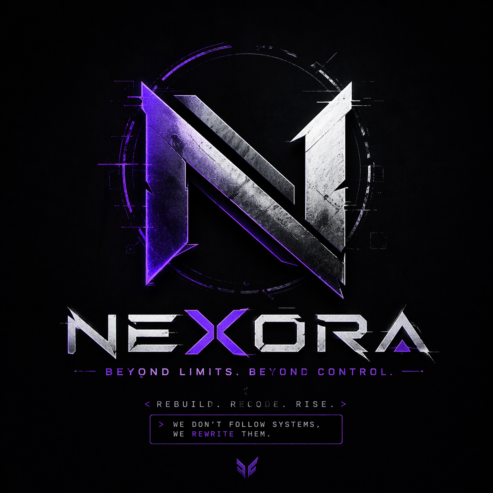

# 🤖 Nexora MD

This is a WhatsApp bot built using the Baileys library for group management, including features like tagging all members, muting/unmuting, and many more. It's designed to help admins efficiently manage WhatsApp groups.

<div align="center"> 
  <a href="https://git.io/typing-svg"> 
    
  </a> 
</div> 

<div align="center"> 
     
</div>

<div align="center">
  <!-- repository badges removed or replace with your own project badges -->
</div>

---
<br>

<br>

<div align="left">
  <a href="https://www.thordata.com/products/residential-proxies?ls=YouTube&lk=NexoraMD" target="_blank">
    
  </a>
</div>


## 🚀 Steps to Deploy Bot

### Step 1: Fork the Repository

Click the button below to fork the Nexora MD repository to your GitHub account:

<div align="center">
  <a href="https://github.com/<your-org>/Nexora-MD/fork">
    
  </a>
</div>

---

### Step 2: Get Pair Code

Deploy the bot and easily connect it to your WhatsApp account by pair code. Click the button below to deploy the bot on Replit.

<div align="center">
  <a href="#" target="_blank">
    
  </a>
</div>


### After getting creds.json file, upload it to session folder

---

### Step 3: Deploy Now

For further customization and setup guidance, click the button below:

<div align="center">
  <a href="#">
    
  </a>
  <a href="#">
    
  </a>
</div>

### Deploy on VPS

<div align="center">
  <a href="#" target="_blank">
    
  </a>
</div>

### Deploy on Below Panel
<div align="center">
<a href="https://dashboard.katabump.com/auth/login#d6b7d6" target="_blank">
  
</a>
</div>

### Join Us

<div align="center">
  <!-- community links removed or replace with your own channels -->
</div>

---

## ⚙️ Features

- **Tag all group members** with the `.tagall` command
- **Admin restricted usage** (Only group admins can use certain commands)
- **Games** like Tic-Tac-Toe for interactive group engagement
- **Text-to-Speech** with `.tts`
- **Sticker creation** with `.sticker`
- **Anti-link detection** for group safety
- **Warn and manage group members** with admin control

---

## 📖 About

Nexora MD is a WhatsApp automation project that helps group admins manage groups and provides utility commands. It uses the `Baileys` library for protocol bindings and supports multi-device (MD) sessions.

The project is modular and customizable — add or edit command files under the `commands/` folder and utilities under `lib/`.

---

## 🛠️ Setup & Installation

### Prerequisites

- Node.js installed on your system
- Git installed (for cloning the repository)

### Step-by-Step Setup

1. **Clone the repository:**

  ```bash
  git clone https://github.com/<your-org>/Nexora-MD.git
  cd Nexora-MD
  ```

2. **Install the dependencies:**

    ```bash
    npm install
    ```

3. **Run the bot:**

    ```bash
    node index.js
    ```

4. **Scan the QR code:**

    Once the bot starts, a QR code will appear in the terminal. Scan this QR code using the Linked Devices feature in WhatsApp to connect your WhatsApp account with the bot.

---

## ☕ Support Me

<div align="center">

<!-- sponsorship/support links removed -->

---


## Contributing

Contributions, issues and feature requests are welcome. The bot's command files live in the `commands/` folder and core utilities are in `lib/` — please follow the existing code style when adding features.

If you open issues or PRs, include reproduction steps and relevant logs.

## License

This repository uses the license declared in `package.json` (see the `license` field). Check `package.json` and the repository's `LICENSE` file for the authoritative license text.

## Credits

- `Baileys` for WhatsApp protocol bindings
- Third-party contributors and libraries listed in `package.json`

## Important notice

This project is an unofficial WhatsApp automation project. Use at your own risk — automated or bulk messaging may violate WhatsApp's terms of service and could lead to account bans.

---

## Quick reference (project state)

- Entry point: `index.js`
- Commands directory: `commands/`
- Helpers and libraries: `lib/`
- Session files: `session/` (upload your `creds.json` or pair code session here)
- Data storage: `data/`

## Requirements

- Node.js 18 or newer (see `engines.node` in `package.json`)

## Installation & run

1. Install dependencies:

```bash
npm install
```

2. Start the bot (common options):

```bash
npm start                # runs `node index.js`
npm run start:optimized  # optimized runtime flags
npm run start:fresh      # reset session then start
```

3. If you need a fresh session or to reset credentials:

```bash
npm run reset-session
```

4. Place your WhatsApp session creds (e.g. `creds.json`) inside the `session/` folder before starting.

## Web dashboard (optional)

You can run a small local dashboard to upload session credentials and check whether a session file exists.

1. Install the dashboard dependencies (if not already installed):

```bash
npm install express multer
```

2. Start the dashboard:

```bash
npm run web
```

Open http://localhost:3000 in your browser. Use the upload form to place `creds.json` into the `session/` folder.

## Where to look

- Command implementations: [commands](commands/)
- Shared utilities: [lib](lib/)
- Persistent data: [data](data/)

If you'd like, I can further tidy the README (remove promotional links, update badges, or add a short developer guide). Which would you like next?
